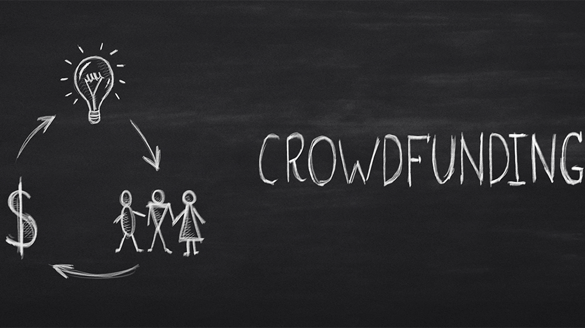

# Crowdfunding_ETL
Project # 2 - ETL Group Project

---
## Table of Contents
- [Background](#background)
- [Data Sources](#data)
- [Findings and Conclusions](#findings)
- [Part 1: A Category and Subcategory DataFrame is Created](#part-1)
- [Part 2: A Campaign DataFrame is Created](#part-2)
- [Part 3: A Contacts DataFrame is Created](#part-3)
- [Part 4: A Crowdfunding Database is Created](#part-4)

---
## Background 

Crowdfunding platforms like Kickstarter and Indiegogo have been growing in success and popularity since the late 2000s. From independent content creators to famous celebrities, more and more people are using crowdfunding to launch new products and generate buzz, but not every project has found success. 

To receive funding, the project must meet or exceed an initial goal, so many organizations dedicate considerable resources looking through old projects in an attempt to discover “the trick” to finding success.

In this Repo we organize and analyze a database of 1,000 sample projects to practice building an ETL pipeline using Python, Pandas, and either Python dictionary methods or regular expressions to extract and transform the data. After we transform the data, we created four CSV files and used the CSV file data to create an ERD and a table schema. 

# Final Production Database
Uploaded the CSV file data into a Postgres database a relational database management system.

---
## Data Sources 
Data for this dataset was generated by edX Boot Camps LLC, and is intended for educational purposes only.
 1.  contacts.xlsx
 2.  crowdfunding.xlsx
---
## Findings and Conclusions 
The following findings and conclusions from the analysis are as follows:
 1.	The largest crowdfunding sub category was “plays” making up roughly 30% of the successful crowdfunding campaigns. The largest        parent category was “Theater”. 

 2. Successful campaigns had a lower average goal amount compared to failed, canceled and live campaigns. Setting lower goal amount would 
 be easier to meet.
 

 3. Majority of the campaigns were successfull over all with 56.5% of the total being successful. Factors of success that contribute to meeting the target outcome are category/theme of the campaign and the target goal amount.

---
## Part 1: A Category and Subcategory DataFrame is Created 
Extracting and Transforming 
  1. Extract and transform the crowdfunding.xlsx Excel data to create a category DataFrame that has the following columns:
    -  A "category_id" column that has entries going sequentially from "cat1" to "catn", where n is the number of unique       categories
    -  A "category" column that contains only the category titles
  2. Export the category DataFrame as category.csv and save it to your GitHub repository.
  3. Extract and transform the crowdfunding.xlsx Excel data to create a subcategory DataFrame that has the following columns:
      -  A "subcategory_id" column that has entries going sequentially from "subcat1" to "subcatn", where n is the number of   unique subcategories              
      -  A "subcategory" column that contains only the subcategory titles
  4.  Export the subcategory DataFrame as subcategory.csv and save it to your GitHub repository.

---
## Part 2: A Campaign DataFrame is Created 
Extracting and Transforming 
1. Extract and transform the crowdfunding.xlsx Excel data to create a campaign DataFrame has the following columns:
      -  The "cf_id" column
      -  The "contact_id" column
      -  The "company_name" column
      -  The "blurb" column, renamed to "description"
      -  The "goal" column, converted to the float data type
      -  The "pledged" column, converted to the float data type
      -  The "outcome" column
      -  The "backers_count" column
      -  The "country" column
      -  The "currency" column
      -  The "launched_at" column, renamed to "launch_date" and with the UTC times converted to the datetime format
      -  The "deadline" column, renamed to "end_date" and with the UTC times converted to the datetime format
      -  The "category_id" column, with unique identification numbers matching those in the "category_id" column of the category DataFrame
      -  The "subcategory_id" column, with the unique identification numbers matching those in the "subcategory_id" column of the subcategory DataFrame
2. Export the campaign DataFrame as campaign.csv and save it to your GitHub repository.

---
## Part 3: A Contacts DataFrame is Created 
Extracting and Transforming 
1. For extracting and transforming the data from the contacts.xlsx Excel data:
      -  Use Python dictionary methods.
    
2. Complete the following steps:
      -  Import the contacts.xlsx file into a DataFrame.
      -  Iterate through the DataFrame, converting each row to a dictionary.
      -  Iterate through each dictionary, doing the following:
         -  Extract the dictionary values from the keys by using a Python list comprehension.
         -  Add the values for each row to a new list.
      -  Create a new DataFrame that contains the extracted data.
      -  Split each "name" column value into a first and last name, and place each in a new column. 
      -  Clean and export the DataFrame as contacts.csv and save it to your GitHub repository.

---
## Part 4: A Crowdfunding Database is Created 
Load
1. Inspect the four CSV files, and then sketch an ERD of the tables by using QuickDBD
2. Use the information from the ERD to create a table schema for each CSV file.
    -  Note: Remember to specify the data types, primary keys, foreign keys, and other constraints.
3. Save the database schema as a Postgres file named crowdfunding_db_schema.sql, and save it to your GitHub repository.
4. Create a new Postgres database, named crowdfunding_db.
5. Using the database schema, create the tables in the correct order to handle the foreign keys.
6. Verify the table creation by running a SELECT statement for each table.
7. Import each CSV file into its corresponding SQL table.
8. Import each CSV file into its corresponding SQL table.

